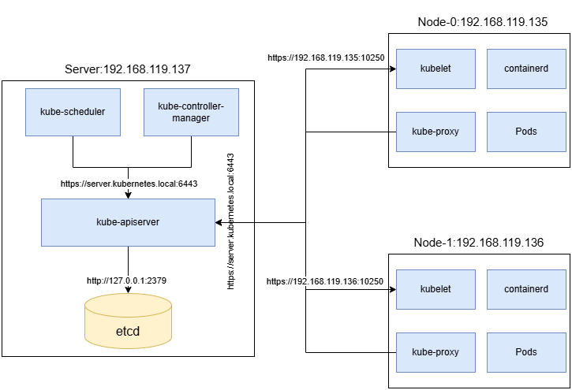

# バイナリファイルから構成されたKubernetesクラスタ
## Features
1. kubeadmなどの既存ツールを使わず、バイナリファイルからKubernetesクラスタを構成する
2. kube-api-serverなどのコンポーネントの証明書と秘密鍵をマニュアルに作成することで、Kubernetes内部のTLS通信により一層深く理解できます。
3. AWSなどのクラウドプロバイダーを使わなく、自身のPCだけにて完結できます。

## Architecture

## Requirements
### オペレーティングシステム
[debian-12.13.0-amd64-netinst](https://www.debian.org/releases/bookworm/debian-installer/)

### 仮想マシン
| Name    | Description            | CPU | RAM   | Storage |
|---------|------------------------|-----|-------|---------| 
| server  | Kubernetes server      | 1   | 2GB   | 20GB    |
| node-0  | Kubernetes worker node | 1   | 2GB   | 20GB    |
| node-1  | Kubernetes worker node | 1   | 2GB   | 20GB    |

### VMwareを使う人へ
debianをインストール済みの仮想マシンファイルを提供しますので、それを使ってVMwareで簡単に再現できると思います。

## etcd構成
1. 台数：単体クラスタ
2. 置く場所：control planeと同じマシン
3. TLS通信：なし
詳細はetcd.mdで確認

## ネットワーク
1. Pod CIDR
10.0.0.0/16
2. Service CIDR
10.32.0.0/24
3. CNI
bridge + host-local
4. Service Proxy
iptables mode

## セキュリティ
- TLS PKI generated manually
- RBAC configured
- ServiceAccount authentication
